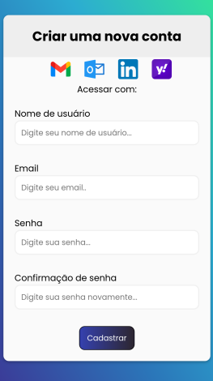

<h1 align="center"> pagina-cadastro </h1>

  <a href="#-tecnologias">Tecnologias</a>&nbsp;&nbsp;&nbsp;|&nbsp;&nbsp;&nbsp;
  <a href="#-projeto">Projeto</a>&nbsp;&nbsp;&nbsp;|&nbsp;&nbsp;&nbsp;
  <a href="#memo-licença">Licença</a>

  

 

<h1>Desktop:</h1>
  

<h1>Mobile:<h1/>
  

## 🚀 Tecnologias

Esse projeto foi desenvolvido com as seguintes tecnologias:

- HTML e CSS
- JavaScript

## 💻 Projeto

O projeto foi desenvolvido com base na vídeo aulas do canal  <a href="https://www.youtube.com/c/GirlCoding"> Girl Coding</a> e do canal <a href="https://www.youtube.com/c/dicasparadevs">Dicas para devs</a> com o objetivo de criar uma página de cadastro em um site aplicando validação garantindo que os dados solicitados nos campos sejam preenhidos e também aplicando a responsividade na página.

## :memo: Licença

Esse projeto está sob a licença MIT.

---
